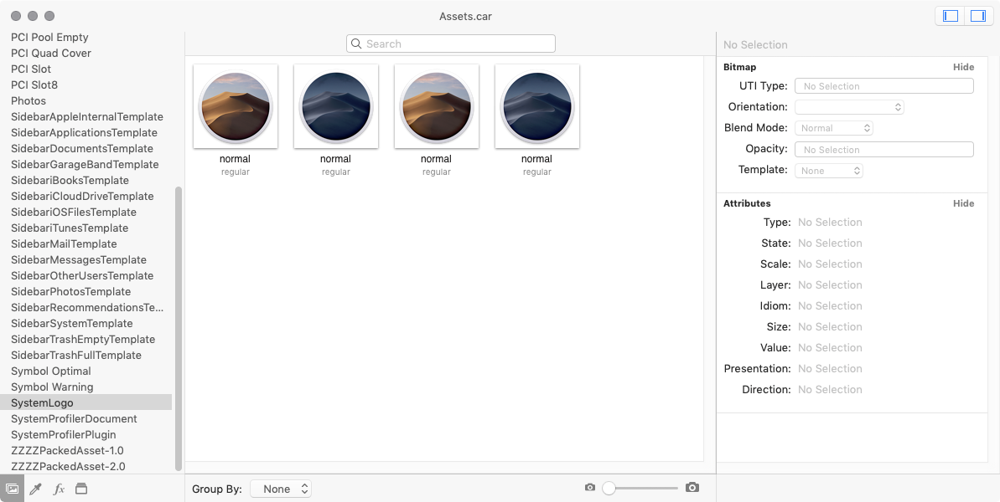
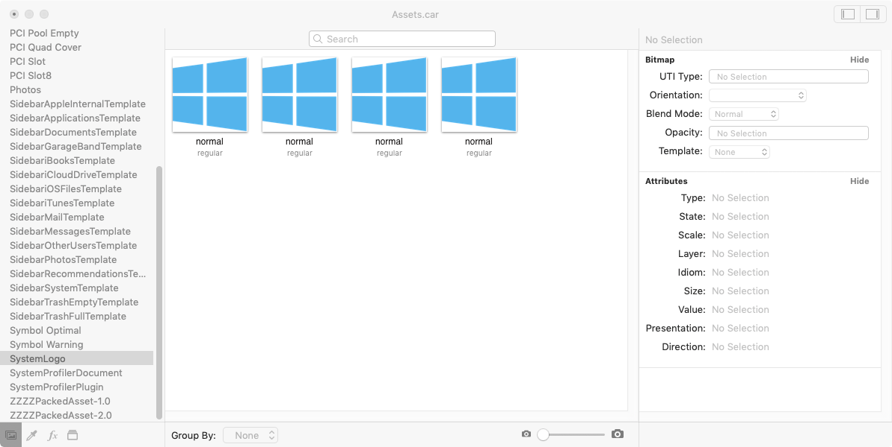
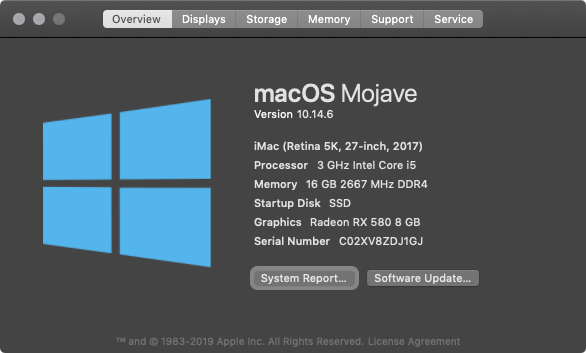
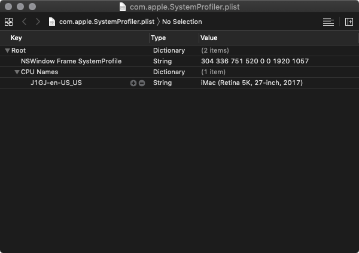
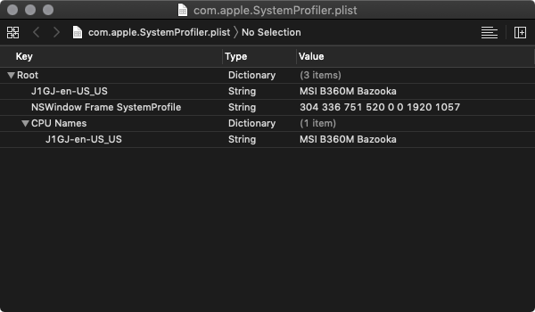
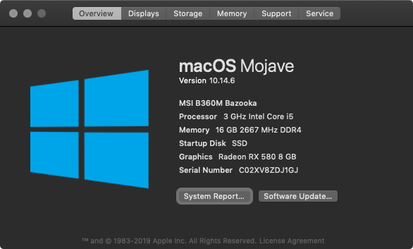
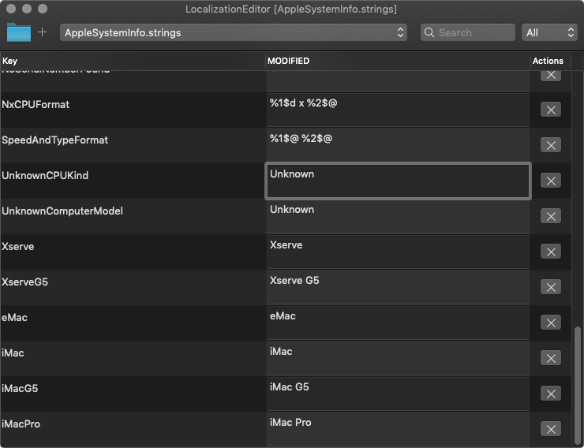
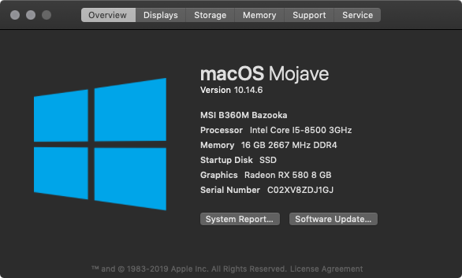
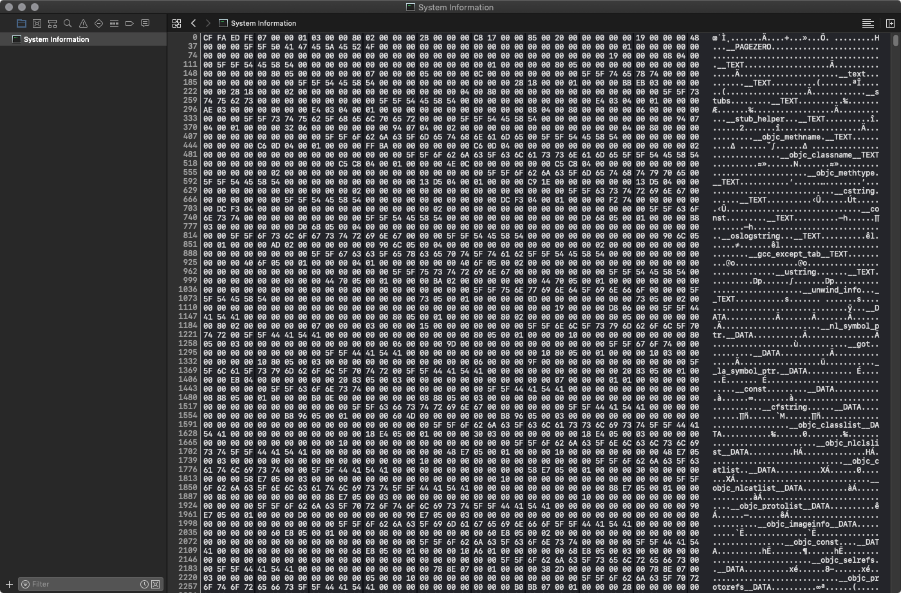
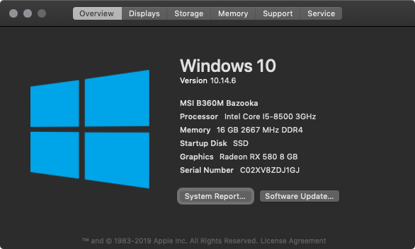

# Initial page

Want to show your actual CPU? Want an absolutely cursed image in your about this Mac? Follow this easy guide!

#### Requirements

* macOS Mojave
* Xcode for plist/hex editor
  * Alternative plist editor of choice
  * Alternative hex editor of choice
* [ThemeEngine](https://github.com/alexzielenski/ThemeEngine/releases) to edit .car files
* [iOSLocalizationEditor](https://github.com/igorkulman/iOSLocalizationEditor) to edit .strings file
* SIP must be disabled temporarily. It can be reenabled afterwards

Although this guide may work on actual Macs, no promise is made. This guide is intended for hackintoshes only.

### Preparation

Create 2 folders in a location of your choice\(Terminal commands assume desktop\), one named backup & another folder named modified. The modification folder is required for some changes we will be making

## Change icon

#### Prerequisite

Create or download yourself a squared, preferably 512x512 .png file you will use

#### Steps to replace

Open a Terminal window and paste the following `cp /Applications/Utilities/System\ Information.app/Contents/Resources/Assets.car ~/Desktop/modified/ && cp /Applications/Utilities/System\ Information.app/Contents/Resources/Assets.car ~/Desktop/backup/` Hit enter, then hit the up arrow key and replace modified with backup. This will copy the original file to both locations.

Open ThemeEngine and click the File option and choose Open, Select the file in your modification folder and open Assets.car:

There are versions for both light and dark mode, with a '@2x' scale version for each. \(By default, the 2x scaled versions are the 2 middle ones\).

To replace the system icon, drag a .png file over the version you wish to replace:

When you're done, hit ⌘WinKey+S to save the Assets.car file

After this, return to the terminal window and type `sudo mv ~/Desktop/modified/Assets.car /Applications/Utilities/System\ Information.app/Contents/Resources/Assets.car` Hit enter, then it will prompt for your password. Enter your password\(it will not appear to be typing, but it is\) and hit enter. This replaces the original file with the new modified one.

NOTE: If you get permission error after entering the command, you have SIP enabled

After the file is replaced, you can open About This Mac and see your changes:

## Changing Mac model name

Copy the original file for backup with

`cp ~/Library/Preferences/com.apple.SystemProfiler.plist ~/Desktop/backup`

Type in a terminal `open ~/Library/Preferences` and search for com.apple.SystemProfiler.plist

Open it in your plist editor of choice:

Under CPU Names should be a string named with the last 4 digits of your serial number and language code.

Edit the Value part however you want. I'm going to set my motherboard name here for example:

Save the file and reboot for changes to take effect:

## Changing CPU name

#### Prerequisite

CPU type in Clover must be set to `Unknown` Your milage may vary on how safe this is, but I had no issues changing this.

#### Steps to edit

Copy the original file with `cp /System/Library/PrivateFrameworks/AppleSystemInfo.framework/Versions/A/Resources/en.lproj/AppleSystemInfo.strings ~/Desktop/backup/ && cp /System/Library/PrivateFrameworks/AppleSystemInfo.framework/Versions/A/Resources/en.lproj/AppleSystemInfo.strings ~/Desktop/backup/`

This assumes you are using english as your system language.

Afterwards open AppleSystemInfo.strings in your modified folder with LocalizationEditor, scrolling down until you see UnknownCpuKind modified as Unknown:

Edit the modified part to whatever you want it to be. I will be setting it to my CPU name.

There is no manual save/undo action, once you are done exit Localizationeditor.

To apply your changes, insert the following into a terminal `sudo mv ~/Desktop/modified/AppleSystemInfo.strings /System/Library/PrivateFrameworks/AppleSystemInfo.framework/Versions/A/Resources/en.lproj/AppleSystemInfo.strings` This will prompt for your password, enter it and hit enter.

Once this is done, reboot for your changes to take effect:

## Changing OS name

#### Preparation

The name you wish to use must be exactly 12 characters, spaces are allowed so if you wish to put less, just add spaces. Anything more or less will result in a malformed About This Mac.

#### Steps to edit

Start by backing up the file with `cp /Applications/Utilities/System\ Information.app/Contents/MacOS/System\ Information ~/Desktop/modified/ && cp /Applications/Utilities/System\ Information.app/Contents/MacOS/System\ Information ~/Desktop/backup/`

After this, `cd ~/Desktop/modified` and run this command to remove the signature from the executable: `codesign --remove-signature System\ Information` This is required since we are modifying the binary directly.

If you're using Xcode, to open the binary in the hex editor, open Xcode &gt; File &gt; Open &gt; Desktop/modified/System Information Once it is opened hit View &gt; Navigators &gt; Show project Navigator. After this right click on the app in the newly open app &gt; Open as Hex:

Hit CMD/Winkey + F to search for MacOS Mojave. On the very left side, this should be numbered at 334495.

Now edit the MacOS Mojave text to anything less or equal to 12 characters. Remember that if it is less than 12 characters, add extra spaces until it is 12 characters.

After this, save your work and exit Xcode.

Enter this into the terminal to replace the original binary with our modified one:

`sudo mv ~/Desktop/modified/System\ Information /Applications/Utilities/System\ Information.app/Contents/MacOS/System\ Information`

After this, you can open About this Mac and your results should appear:

## Finish

Now that this is done, you can reboot with SIP enabled, and you should be good!

Errors? Something wrong? Open an issue and I'll get to it.

